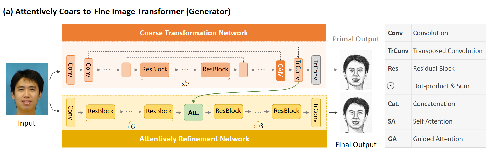
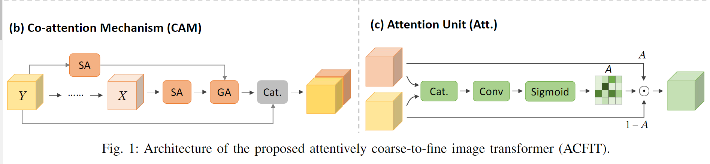
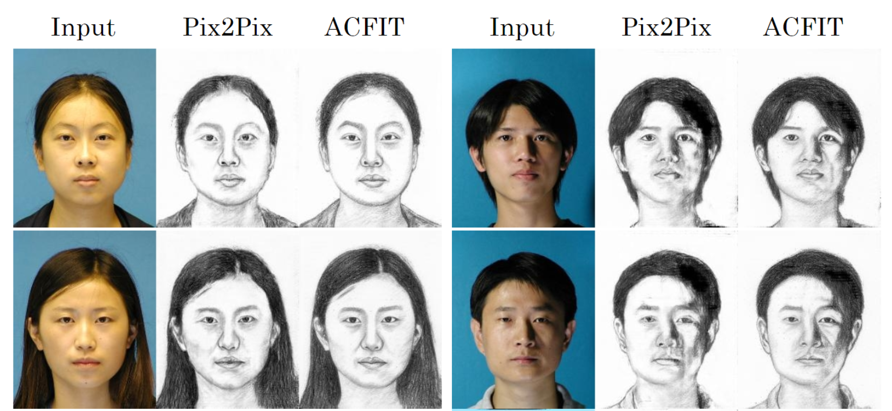
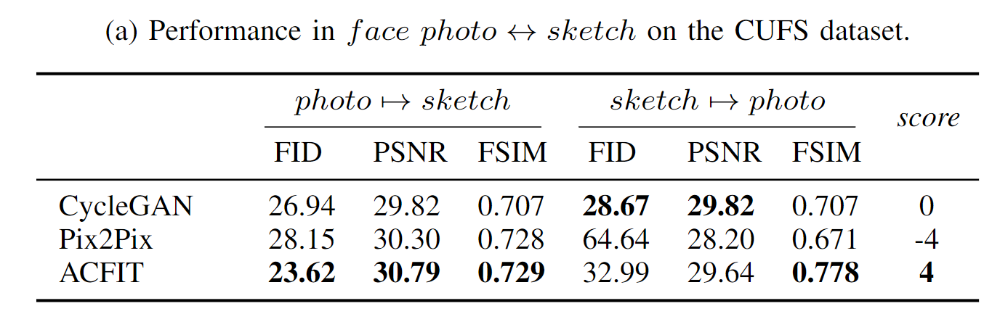

# chan

## Coarse-to-Fine Image-to-Image Translation via Attentively Collaborative

we provide PyTorch implementations for our paper "We provide PyTorch implementations for our CVPR 2019 paper "APDrawingGAN: Generating Artistic Portrait Drawings from Face Photos with Hierarchical GANs"

### Our Proposed Framework


### Sample Result
Up: input, Down: output

### Prerequisites
- Linux
- Python 2.7
- NVIDIA GPU + CUDA CuDNN

### Getting Started

#### installation
- clone this repo:
```shell script
git clone https://github.com/jehovahxu/chan.git
cd chan
```
- install PyTorch 0.4+
#### Quick Start(Apply a Pre-trained Model)
- Download a dataset([CUFS](http://mmlab.ie.cuhk.edu.hk/archive/facesketch.html) split train and test with this [files](https://drive.google.com/open?id=1TYQ5O9q4ZMiuBimPMqqj7O_SyHoijwmn))
- Download a pre-trained model(pre-trained with [pix2pix](https://github.com/jehovahxu/pix2pix-pytorch))
- Train a model (you need make sure your CUDA is available):
    - you can download a pre-trained model in [here](https://drive.google.com/open?id=1dfe2pqAUD4T6fD9vO38SM2HCYJSe9Nxj)
    ```shell script
    python train.py --dataroot {your dataset} --datalist {your datalist} --pre_netG {pre-trained netG} --gpuid {your gpu ids}  
    ```
- Test
    - you can download a final model which we trained in [here](https://drive.google.com/open?id=173H7FdwG7UOMM1G-4sm7zKUBu0yFypul)
    ```shell script
    python test.py --dataroot {your dataset} --datalist {your datalist} --pre_netG {final netG} --gpuid {your gpu ids}
    ```
### Result
Our final result can be downloaded in [here]()


### Training/Test Tips
Best practice for training and testing your models.<p>
Feel free to ask any questions.Xingxin Xu, [jehovahxu@gmail.com](jehovahxu@gmail.com)<p>
### Acknowledgments
Our code is inspired by [pytorch-CycleGAN-and-pix2pix](https://github.com/junyanz/pytorch-CycleGAN-and-pix2pix)

<!--
### Citation
If you use this code for your research, plase cite our papers.
-->


